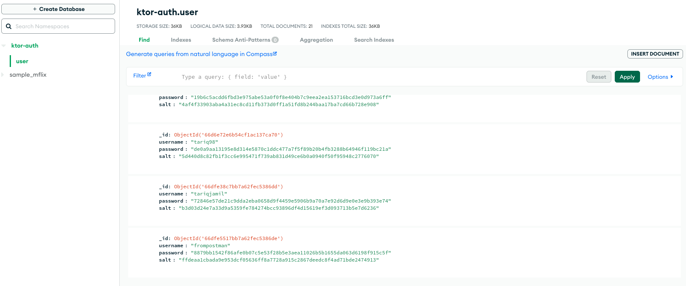
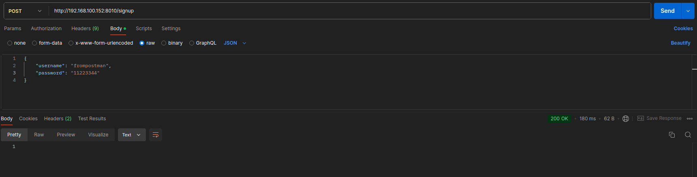
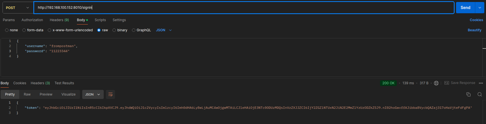
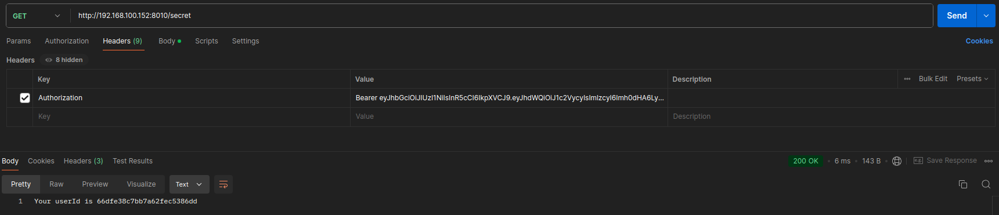

# Ktor Authentication API

This repository contains a Ktor-based authentication API integrated with JWT (JSON Web Token) for secure authentication and data storage in MongoDB. The API supports username and password-based authentication. Passwords are hashed using SHA-256 before being stored in the database. The API server can be tested using Postman or the provided Ktor Authentication App.

## Features

- **JWT Authentication**: Secure user authentication using JSON Web Tokens.
- **MongoDB Integration**: Data storage using MongoDB.
- **SHA-256 Password Hashing**: Passwords are hashed using SHA-256 for security.
- **Configurable for Local Use**: Easily configurable to run locally with your IP address and MongoDB data source.

## Prerequisites

- [Kotlin](https://kotlinlang.org/) (for backend development)
- [Ktor](https://ktor.io/) (Kotlin framework for building APIs)
- [MongoDB](https://www.mongodb.com/) (for data storage)
- [Postman](https://www.postman.com/) (for API testing)
- Java Development Kit (JDK) installed on your machine
- Internet access for downloading dependencies

## Getting Started

### 1. Clone the Repository
### 2. Configure Environment Variables

Update the following configuration details in the code to match your environment:

- **MongoDB Data Source**: Update the MongoDB connection string with your own database details.
- **IP Address**: Modify the API base URL with your local IP address to connect with your emulator or physical device.

### 3. Build and Run the API

1. Open the project in your preferred IDE (e.g., IntelliJ IDEA).
2. Build the project to resolve dependencies and compile the source code.
3. Run the application using the IDE's run command.

The server should now be running locally.

### 4. Test the API with Postman

- Import the Postman collection (provided in the repository) or create a new request.
- Use the `POST` endpoint to test user authentication with username, password, and address.
- Ensure you have updated the IP address to match your localhost setup.

### 5. Ktor Authentication App

The repository also includes a sample application named [**Ktor Authentication App**](https://github.com/tariqjamel/Ktor-Authentication-App), which demonstrates how to connect and use the API.

#### Steps to Run the App

1. Navigate to the [**Ktor Authentication App**](https://github.com/tariqjamel/Ktor-Authentication-App) folder within the repository.
2. Build and run the app on an emulator or physical device.
3. Ensure the IP address and MongoDB connection string in the app match your local setup.

## MongoDB Data Viewing

You can view the stored data in MongoDB by following these steps:

1. Open MongoDB Compass or your preferred MongoDB client.
2. Connect to your MongoDB instance using the connection string provided in your configuration.
3. Navigate to the database used by the API.
4. Go to the **Collections** tab to view and manage the data. Look for a collection named **`service`** where user data and other related information are stored.

### Screenshot

## API Endpoints

### Authentication Endpoints

| Method | Endpoint             | Description                                           |
|--------|----------------------|-------------------------------------------------------|
| POST   | `/api/auth/login`    | Logs in a user and generates a JWT token.             |
| POST   | `/api/auth/signup`   | Registers a new user with username, hashed password, and address. |
| GET    | `/api/auth/secret`   | Retrieves user secrets based on the provided user ID. |

### `POST /ipaddress/signup`

#### Description

This endpoint allows a new user to sign up by providing a username, password, and address. The password is hashed before being stored.

#### Request

- **Method**: `POST`
- **URL**: `/ipaddress/signup`
- **Headers**:
  - `Content-Type`: `application/json`
- **Body**:
  - `username`: The desired username.
  - `password`: The password for the new account.
 
### Screenshot

### `POST /ipaddress/signin`

#### Description

This endpoint allows a user to sign in using their username and password. Upon successful authentication, a JWT token is generated.

#### Request

- **Method**: `POST`
- **URL**: `/ipaddress/signin`
- **Headers**:
  - `Content-Type`: `application/json`
- **Body**:
  - `username`: The username of the user.
  - `password`: The user's password.

### Screenshot

### `GET /ipaddress/secret`

#### Description

This endpoint retrieves user secrets based on the user ID provided in the request. The user must be authenticated, and the request must include a valid JWT token in the authorization header.

#### Request

- **Method**: `GET`
- **URL**: `/ipaddress/secret`
- **Headers**:
  - `Authorization`: `Bearer <JWT Token>`

#### Query Parameters

- `userId`: The unique identifier of the user whose secrets you want to retrieve.

### Screenshot

## Responses

#### Success Response

- **Status**: 200 OK
- **Body**: JSON object containing the user's secrets.

#### Error Responses

- **401 Unauthorized**: Invalid or missing JWT token.
- **404 Not Found**: User not found or user does not have any secrets.

## Configuration Notes

- Ensure your MongoDB instance is running and accessible.
- Modify the `.env` or configuration files as needed to match your IP and database credentials.
- The API uses SHA-256 for password hashing, which provides enhanced security.

## Contributing

Contributions are welcome! If you have any suggestions, bug fixes, or feature implementations, please submit a pull request.

